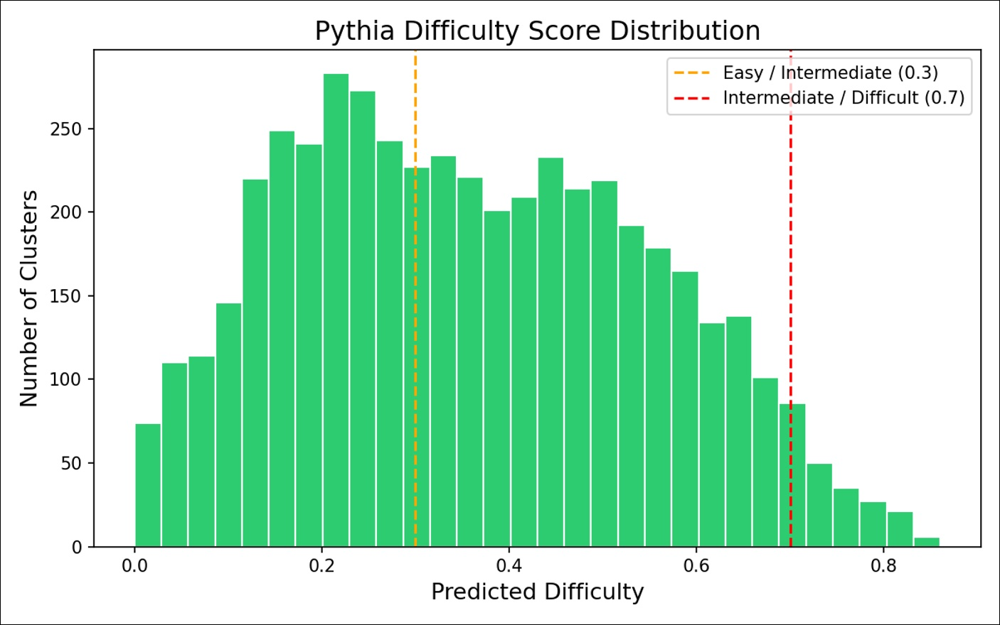
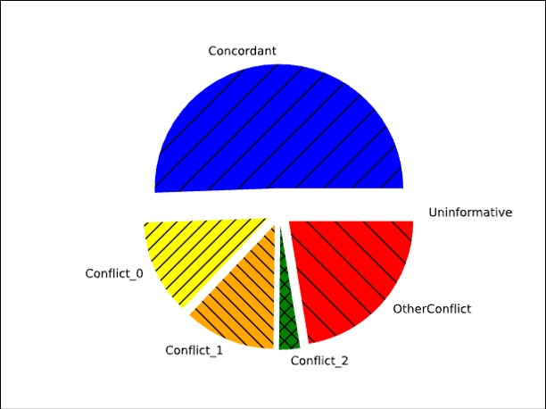
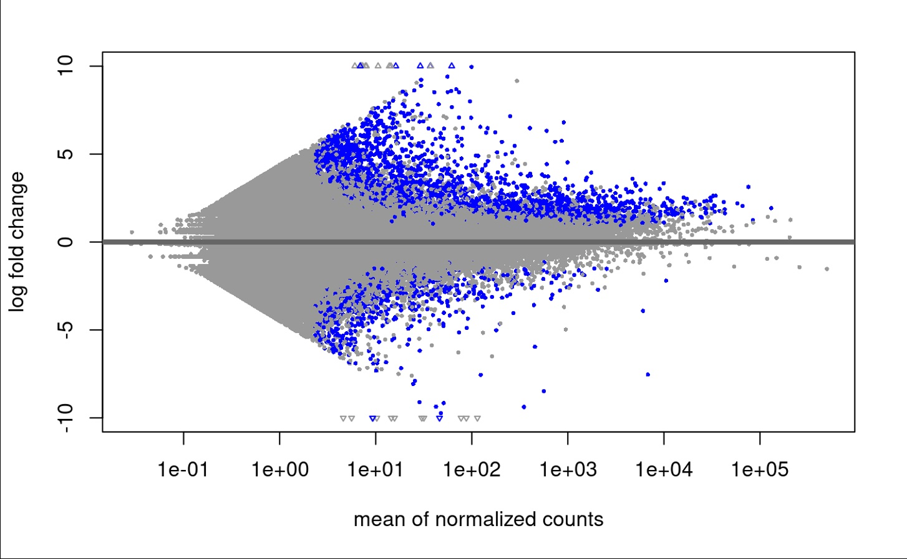
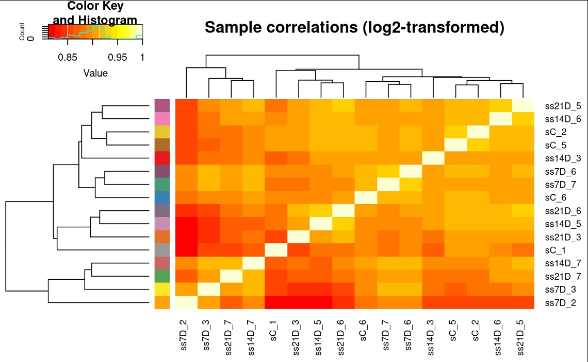

# Hi, I'm Tomi Jacobs

I am a 3rd year PhD Candidate at the University of Illinois Chicago, studying the dynamics of computation and genetics — building bioinformatics pipelines by utilizing shell scripting, programming languages, and models to decode large-scale phylotranscriptomics data.

A creative soul, inspired by the art of poetry, the lens of photography, period pieces & timeless books.

---

## Research Interests

Bioinformatics: Methods development & Phylogenomics

---

## Research Highlights

<table>
  <tr>
    <td align="center" width="25%">
       
      <b>Pythia Difficulty Score</b> 
      Ph.D. — UIC
    </td>
    <td align="center" width="25%">
       
      <b>Conflict Analysis</b> 
      Ph.D. — UIC
    </td>
    <td align="center" width="25%">
       
      <b>Differential Gene Expression</b> 
      M.S. — Cornell
    </td>
    <td align="center" width="25%">
       
      <b>Sample Correlation Heatmap</b> 
      M.S. — Cornell
    </td>
  </tr>
</table>

---

## Featured Projects

### Pythia Difficulty Score Analysis *(University of Illinois Chicago, Ph.D.)*
Applied the Pythia tool to evaluate per-dataset difficulty scores across phylogenetic clusters. The distribution of predicted difficulty scores was used to classify datasets as easy, intermediate, or difficult — informing downstream phylogenetic inference strategies.

---

### Conflict Analysis *(University of Illinois Chicago, Ph.D.)*
Phylogenetic conflict analysis examining the proportion of concordant, uninformative, and conflicting sites across the dataset. Each category reflects the degree of agreement between gene trees and the species tree.

---

### WGCNA for Sugar Maple Transcriptomics *(Cornell University, M.S.)*
Carried out bioinformatics research using Weighted Gene Correlation Network Analysis (WGCNA) to identify key genes regulating drought resistance in *Acer saccharum* (Sugar Maple). Pipeline included DESeq2 differential expression analysis, variance stabilizing transformation, and co-expression network construction.

🔗 [View Repository](https://github.com/tomi-jacobs/Weighted-Gene-Correlation-Network-Analysis-WGCNA-for-MapleTranscriptomics)

---

### Phytosociological Survey of Weeds on a Date Palm Plantation *(University of Ilorin, B.S.)*
Conducted a field-based phytosociological survey to identify and characterize weed species compositions within a Date palm (*Phoenix dactylifera*) plantation. This undergraduate research laid the foundation for integrating botanical fieldwork with data analytics.

---

## Skills & Tools

---

## GitHub Stats

  

  

---

## Education

| Degree | Institution | Field |
|--------|-------------|-------|
| Ph.D. Candidate | University of Illinois Chicago | Bioinformatics, Phylogenetics, Evolutionary Biology |
| M.S. | Cornell University | Bioinformatics / Plant Transcriptomics |
| M.S. | Delaware State University | Plant Genetics & Bioinformatics |
| B.S. | University of Ilorin, Nigeria | Plant Biology *(Minor: Data Analytics)* |

---

## Connect With Me

---

*"Advancing science, one code at a time."*
